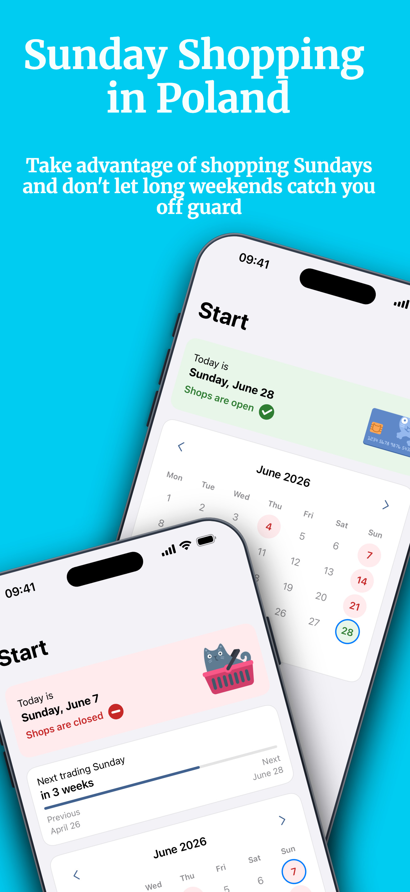
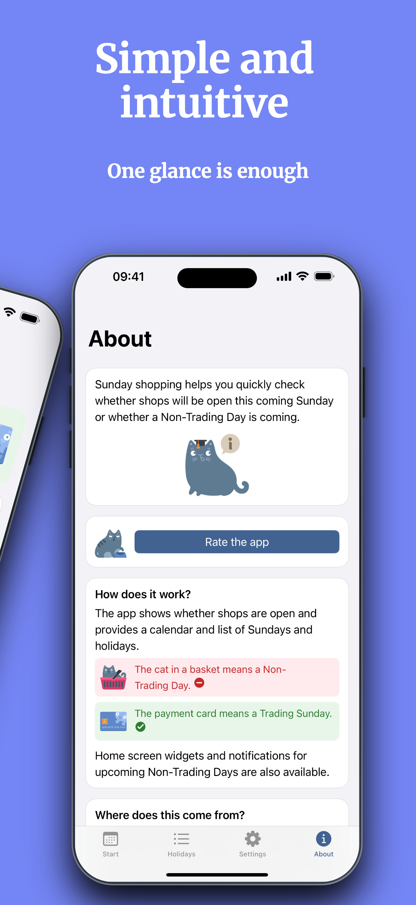
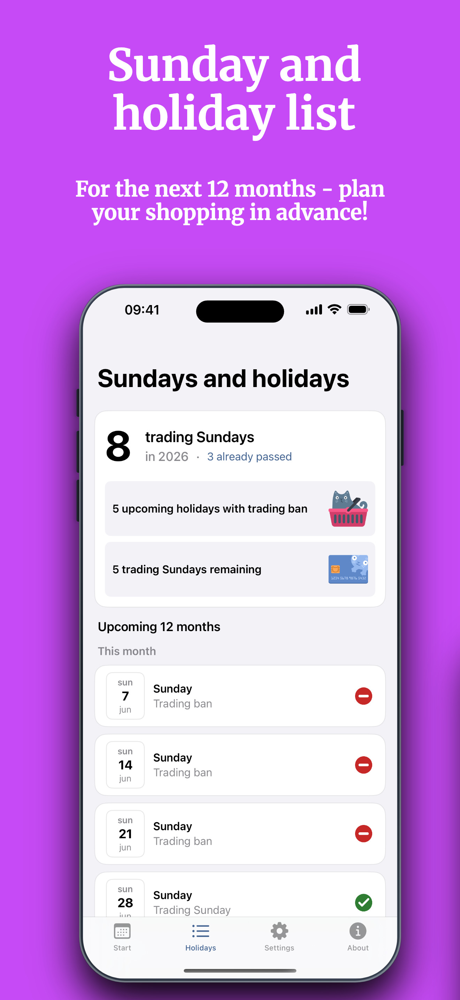
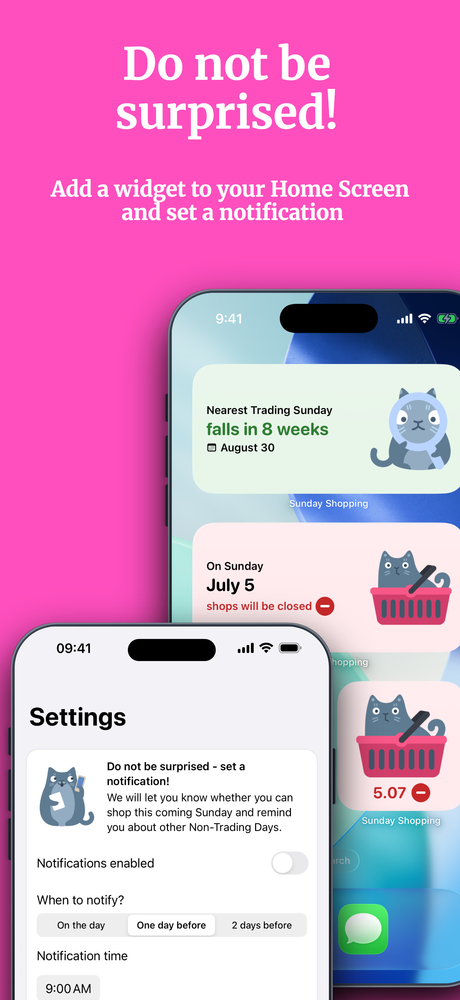
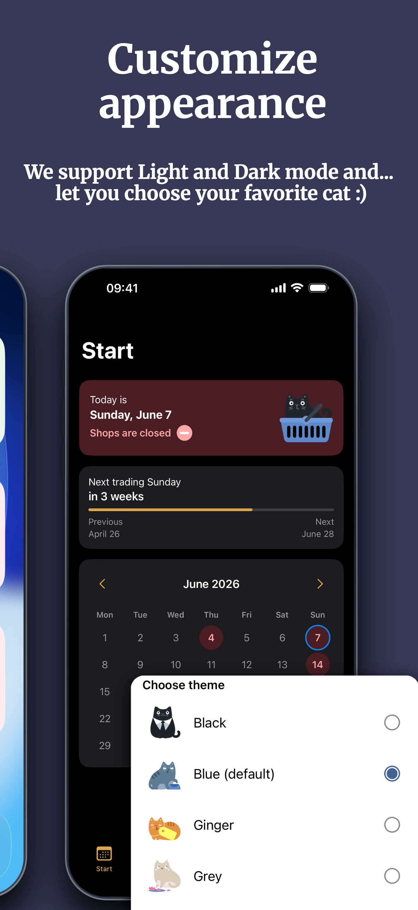

# Niedzielne Zakupy

**Check whether stores in Poland are open today.**  
Niedzielne Zakupy is an iOS and Android app that shows trading Sundays, days with trading restrictions, public holidays, and upcoming shopping dates.

[Polska wersja](README.md)

This is the public „issues-only” repository for the **Niedzielne Zakupy** app. It does not contain the source code. It is used for:

- reporting bugs,
- suggesting improvements,
- reporting text or translation issues.

**Download:** [App Store](https://apps.apple.com/pl/app/niedzielne-zakupy/id6784206894?l=en) · [Google Play](https://play.google.com/store/apps/details?id=fringoo.tbansundays&hl=en)  
**Feedback:** [Report a bug](../../issues/new?template=bug_report.yml) · [Suggest an improvement](../../issues/new?template=feature_request.yml) · [Text or translation issue](../../issues/new?template=translation_fix.yml)

---

  
  
  
  
  

---

## Report a problem

Before opening a new issue, please check whether a similar problem has already been reported in Issues.

When reporting a bug, include:

- app version,
- platform: iOS or Android,
- device model,
- system version,
- app language,
- what you tried to do,
- what you expected to happen,
- what happened instead,
- screenshot or screen recording, if helpful.

**[Report a bug](../../issues/new?template=bug_report.yml)**

## Suggest a change

Small, concrete suggestions are the most useful because they are easier to verify and design.

Good examples:

- "The widget label is hard to read on dark wallpaper."
- "The calendar should make the next trading Sunday easier to spot."
- "I would like a reminder one day before a trading Sunday."

**[Suggest an improvement](../../issues/new?template=feature_request.yml)**

## Text and translations

If app text sounds unnatural, unclear, too formal, or simply wrong, please report it here:

**[Text or translation issue](../../issues/new?template=translation_fix.yml)**

---

  © 2026 Fringla Studio  fringla.com</a>

