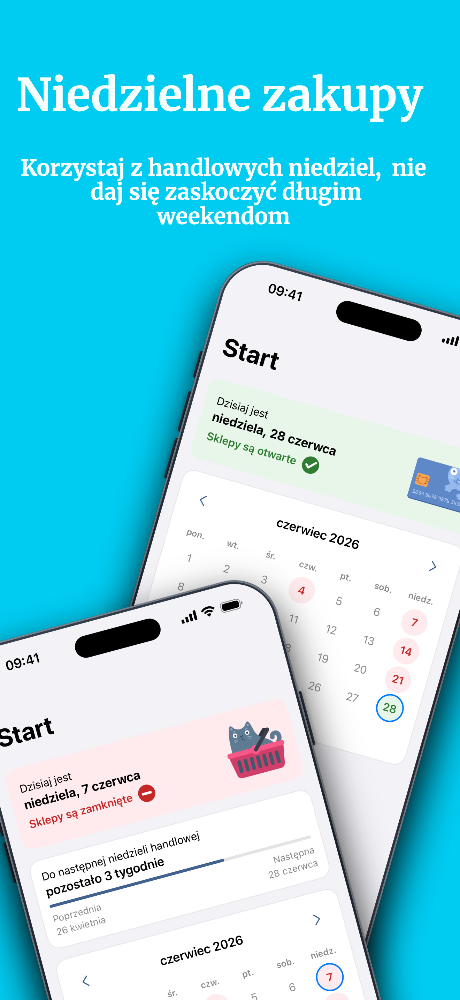
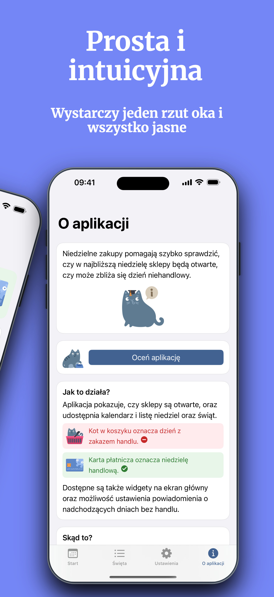
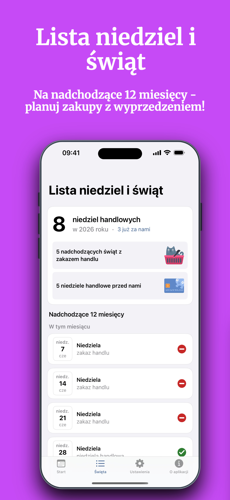
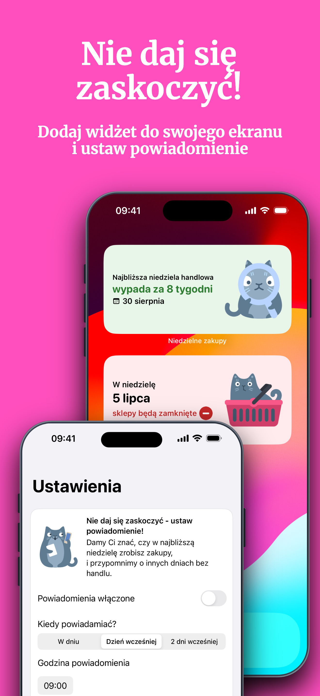
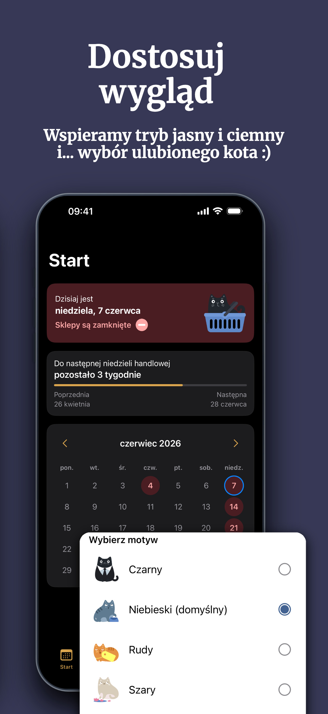

# Niedzielne Zakupy

**Sprawdź, czy sklepy w Polsce są dziś otwarte.**  
Aplikacja pokazuje niedziele handlowe, dni z zakazem handlu, święta oraz najbliższe terminy zakupów.

Niedzielne Zakupy to prosta aplikacja dla iOS i Androida, przygotowana przez **Fringla Studio**.

[English version](README.en.md)

**Pobierz:** [App Store](https://apps.apple.com/pl/app/niedzielne-zakupy/id6784206894?l=pl) · [Google Play](https://play.google.com/store/apps/details?id=fringoo.tbansundays&hl=pl)  
**Feedback:** [Zgłoś błąd](../../issues/new?template=bug_report.yml) · [Zaproponuj ulepszenie](../../issues/new?template=feature_request.yml) · [Problem z tekstem lub tłumaczeniem](../../issues/new?template=translation_fix.yml)

---

  
  
  
  
  

## Co robi aplikacja

Aplikacja pokazuje:

- czy dziś sklepy są otwarte,
- kiedy wypada najbliższa niedziela handlowa,
- które święta oznaczają zakaz handlu,
- kalendarz i listę nadchodzących dni,
- przypomnienia i widżety na ekran telefonu.

## Publiczne repo aplikacji

To jest publiczne repozytorium aplikacji **Niedzielne Zakupy**.

Nie zawiera kodu źródłowego. Służy do:

- zgłaszania błędów,
- proponowania usprawnień,
- zgłaszania problemów z tekstem lub tłumaczeniem,
- opisywania problemów z widżetami lub powiadomieniami,
- śledzenia publicznych aktualizacji produktu.

## Zgłoś problem

Przed otwarciem nowego zgłoszenia sprawdź, czy podobny problem nie został już opisany w Issues.

W zgłoszeniu błędu najlepiej podać:

- wersję aplikacji,
- platformę: iOS albo Android,
- model urządzenia,
- wersję systemu,
- język ustawiony w aplikacji,
- co próbowałeś lub próbowałaś zrobić,
- czego oczekiwałeś lub oczekiwałaś,
- co stało się zamiast tego,
- screenshot albo nagranie ekranu, jeśli pomaga wyjaśnić problem.

**[Zgłoś błąd](../../issues/new?template=bug_report.yml)**

## Zaproponuj zmianę

Najbardziej przydatne są małe, konkretne sugestie, które da się łatwo sprawdzić i zaprojektować.

Dobre przykłady:

- "Etykieta w widżecie jest trudna do odczytania na ciemnej tapecie."
- "Kalendarz powinien wyraźniej pokazywać najbliższą niedzielę handlową."
- "Chcę dostać przypomnienie dzień przed niedzielą handlową."

**[Zaproponuj ulepszenie](../../issues/new?template=feature_request.yml)**

## Teksty i tłumaczenia

Jeśli tekst w aplikacji brzmi nienaturalnie, jest niejasny, zbyt formalny albo po prostu błędny, zgłoś to tutaj:

**[Problem z tekstem lub tłumaczeniem](../../issues/new?template=translation_fix.yml)**

---

## Fringla Studio

  

  © 2026 Fringla Studio ·
  <a href="https://fringla.com">fringla.com</a> ·
  <a href="mailto:hello@fringla.com">hello@fringla.com</a>

